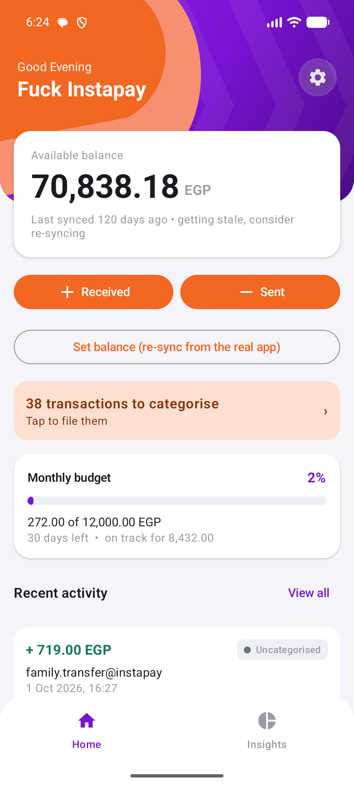
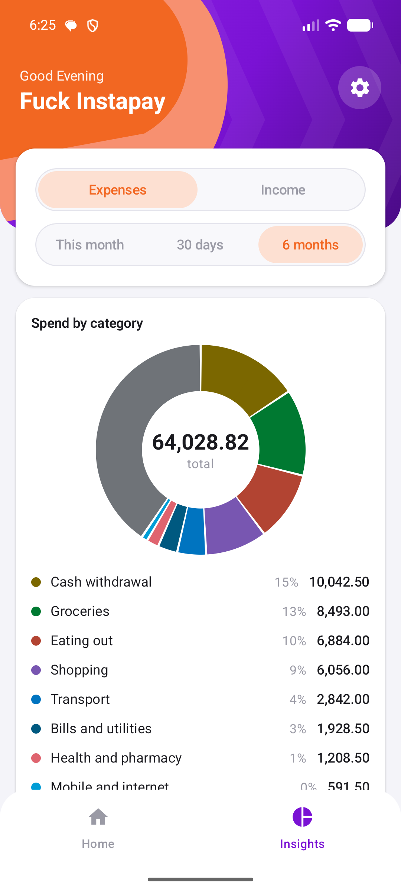
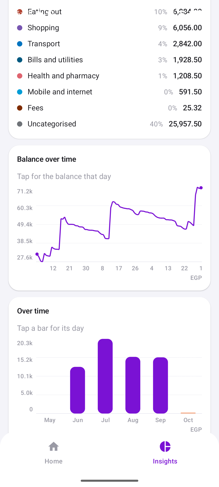
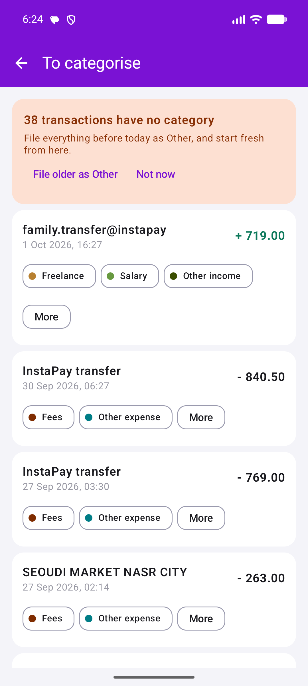

# InstaBalance

An offline Android app that tells you your InstaPay balance without opening InstaPay.

InstaPay (Egypt's instant payment network) makes you log in every single time just to see a number
you already own. InstaBalance keeps its own ledger of that number: you anchor it once from the real
app, and from then on it stays current by reading the transaction notifications and bank SMS that
your phone already receives.

Built with Kotlin and Jetpack Compose. No backend, no network calls, no analytics.

| Home | Insights | Charts | Review inbox |
| --- | --- | --- | --- |
|  |  |  |  |

*Sample data. The shop names are real chains, because that is what the parser has to cope with; the
handles are deliberately generic.*

## How the balance stays right

The ledger is an append-only list of entries, and the balance is derived, never stored:

```
balance = latest ANCHOR + signed sum of every transaction recorded after it
```

- **ANCHOR** is "I checked the real app, it is exactly X." That is the trust reset.
- **CREDIT / DEBIT** are money in and out, either typed manually or captured automatically.

Because the balance is recomputed from the anchor forward, a missed or mis-parsed message can only
drift you until your next re-sync, and it can never corrupt a stored total. The home screen shows
how stale the anchor is (`today`, `3 days ago`) so you know how far to trust the figure.

Some bank messages report the available balance themselves (an ATM withdrawal always does). Those
re-anchor the ledger automatically, and the home screen says when a sync came from the bank rather
than from you, because the two are not equally trustworthy: yours was read off the real app, this
one is only as right as the message it came from.

**Why that matters, measured.** A 1,040.07 EGP divergence turned out to decompose exactly: 1,031.57
was money the bank moved without sending any message at all, 5.50 was an anchor already wrong when
it was typed, 2.50 was a fee the app invented, and 0.50 was a mobile-operator SMS being read as a
bank debit. The app's own share of a figure that looked alarming was three pounds. Automatic
re-anchoring would have caught the rest within a day, because the withdrawals that carry a balance
happen often enough.

## Expense tracking

Every transaction can carry a category, and the Insights tab is built from them: a tappable ring of
spend by category (toggling between expenses and income), a balance line scaled to its own range
rather than from zero, daily and monthly bars, and this month measured against the same days of
last month rather than against a whole month, which would make every early-month figure look like a
collapse. Each category can also carry its own monthly limit, which is the one people actually
enforce ("eating out under 3,000") and which a single monthly figure cannot express.

The charts derive off the main thread behind skeletons, because the balance line is a scan of the
ledger per day it draws.

The interesting problem is that **transactions arrive on their own**. Every other expense tracker
has a human typing each entry and picking a category in the same breath; this one has a notification
listener firing at 2am. So categorisation is built around what the message actually tells us:

- A card purchase names the shop (`من PAYMOB RAF SPECIALIT CAIRO`). File it once and the app offers
  to remember it, so every future PAYMOB charge files itself, even while the app is closed.
- An InstaPay send seen as a bank SMS names **nobody** (`IPN REF# 19825518418`). There is genuinely
  nothing to learn from, so those land in a review inbox and the empty state says so plainly instead
  of pretending the app will eventually work it out.

A rule never rewrites history on its own. Entries filed by a rule are marked as such, so changing a
rule can offer to update the ones it filed while never touching a category a person chose by hand.
A rule can also carry a label, which changes what you see without changing what it matches.

Three things chip away at the pile that is left:

- **The moment it lands.** A transaction no rule can file posts a silent notification offering the
  three likeliest categories, so you file it while you still remember what it was. It never makes a
  sound and it cancels itself the moment the transaction is categorised.
- **An amount twin.** A nameless transfer offers the categories you gave to past transfers of the
  identical amount, which is usually the same standing arrangement.
- **One digest, in the evening.** Whatever is still waiting at 21:00 gets counted in a single
  notification. Deliberately not "six hours after it arrived", which floats: buy something at ten at
  night and six hours later is four in the morning.

If a transaction arrives twice, once named and once not, the name is merged onto the entry that
kept and the rules get their chance at it.

## Budgets

Set a monthly limit and the app alerts at 25, 50, 75, 90, 100 and 120 percent. If one transaction
passes several thresholds at once, only the highest is sent.

That rule is not special-cased. The whole thing reduces to one stored integer: the app asks only for
the highest milestone at or below the current percentage, and fires it only if it beats what is
already stored for this month. An expense taking you from 20 to 80 percent therefore fires 75 once,
and 25 and 50 never fire at all. The same shape gives three more properties for free: no milestone
fires twice, a refund that drops you back under a threshold does not re-arm it, and lowering your
limit mid-month recomputes rather than retro-firing everything beneath it.

Two details that matter more than they look:

- **Money is integer piastres, never `Double`.** `0.1 + 0.2 != 0.3` in floating point, and that
  error compounds over a month of transactions. See [Money.kt](app/src/main/java/com/instabalance/Money.kt).
- **The InstaPay send fee is its own ledger line.** A send SMS reports the transfer amount only, so
  the fee (percent, with a floor and a cap, all configurable) is added as a separate DEBIT. Without
  it the balance drifts low by a few pounds per transfer.

## Reading the messages

[BalanceParser.kt](app/src/main/java/com/instabalance/BalanceParser.kt) turns a notification or SMS
into a transaction, and returns null for anything that is not one. It handles both languages the
bank actually sends:

| Message | Result |
| --- | --- |
| `Your account was credited by EGP 100 ... IPN REF#` | CREDIT 100.00 |
| `Your account was charged by EGP 1105 ... IPN REF#` | DEBIT 1105.00, plus a fee line |
| `تم الشراء بمبلغ 165جم على الكارت رقم +++0954` | DEBIT 165.00 |
| `تم سحب 100جم من حساب 0057*100 من ATM الرصيد المتاح 2091.36جم` | DEBIT 100.00, not 2091.36 |
| `تم الغاء الشراء بمبلغ 23.8جم على الكارت` | CREDIT 23.80 (a reversal returns money) |

The awkward cases are the ones worth pointing at: the available-balance clause is stripped before
the amount is matched, so an ATM withdrawal is not read as its own balance; a cancelled purchase
flips direction to a credit; and Arabic-Indic digits (٠-٩) are normalised to ASCII first.

The same transaction often arrives twice, once as a notification and once as an SMS. A 20 minute
dedupe window on (direction, amount) collapses those into one entry.

**Not everything with a number in it is money.** Senders default to the bank, and a message
carrying a link is never a transaction. Both guards exist because of one real advert:

```
50% خصم! عرض السنجل بوم بـ175ج! بس
ساندوتش+فرايز+سلو+مشروب والتوصيل10ج فقط
https://bit.ly/DushkaApp
```

`خصم` means "deduction" on a bank statement and "discount" in an ad, and `175ج` is a price next to
a currency, so with an open sender list that lands in the ledger as a 175 EGP purchase. The word
stays in the vocabulary, because it is the honest word for a deduction; the sender and the link are
what give the advert away.

Messages that arrived while the app was not running can be recovered too: a scan of the last 30, 90
or 365 days of stored bank SMS imports whatever is missing. It deliberately neither re-anchors the
balance nor posts notifications, because a weeks-old reported balance would corrupt the anchor and a
year-long scan would post one notification per transaction.

**Learning mode** records the raw text of watched notifications and money SMS in the app, so you can
read the exact wording your bank uses and tighten the parser or the watched package list against it.
It reads only the packages you list, and it is off by default.

## Privacy and security

The data never leaves the phone, so the threat model is someone holding the unlocked device.

- The ledger is written to `ledger.enc`, AES-256-GCM encrypted with a key generated inside the
  **Android Keystore**. The key is non-exportable and device bound, so the file is useless if copied
  off the phone. See [SecureStore.kt](app/src/main/java/com/instabalance/SecureStore.kt).
- A 4 digit passcode plus optional biometric unlock gates the app, and it re-locks the moment the
  app leaves the screen. The PIN itself is never stored: only a PBKDF2-HMAC-SHA256 hash over a fresh
  16 byte random salt, at 120,000 iterations, compared in constant time.
- `FLAG_SECURE` is set on the window, so the OS never snapshots your balance into the app switcher
  and screenshots of it are blocked.
- The Keystore key deliberately does **not** require per-use authentication. The background SMS and
  notification readers have to decrypt, update and re-encrypt while the app is closed, and they
  cannot raise a fingerprint prompt. The app lock is the user-facing protection instead.
- `RECEIVE_SMS` reads incoming messages only. The app is not, and does not ask to be, the default
  SMS app. `READ_SMS` is asked for only when you tap "Scan past messages", never at startup.
- Notifications carry a redacted public version, so an amount and a counterparty cannot be read off
  a locked phone, and the one-tap category buttons require an unlock when a passcode is set. A
  `FLAG_SECURE` window is worth nothing if the same figure sits in the shade.
- A restored backup cannot change which apps or SMS senders the app reads, or its backup schedule.
  That configuration belongs to the device, not to a file somebody handed you.

## Backups

Uninstalling destroys the Keystore key, and no phone backup can bring it back, so a copy is the
only thing standing between a reinstall and starting over.

The app writes one itself, into `Download/InstaBalance`, as often as you like and keeping as many as
you like. The interesting constraint is that a backup has to survive the thing it protects against:
`ledger.enc` is encrypted under a device-bound Keystore key, which is exactly right for a file that
must never leave the phone and exactly useless for one that has to open on the next phone. So the
automatic backups are AES-256-GCM under a key derived from a passphrase (PBKDF2-HMAC-SHA256, 210k
iterations, fresh salt and IV per file), and the passphrase itself lives Keystore-wrapped so the
2am alarm can encrypt without anybody there to type it.

The schedule skips a run when nothing has changed, measured against what the file would actually
contain rather than just the transactions, because a week of curating rules with no new spending is
exactly the hand-made state worth keeping.

Restoring detects an encrypted file by reading it rather than by its extension, and asks for the
passphrase. Lose the passphrase and the backups are unreadable, including by us; the dialog says so
before you set one.

## Running it

Open the project in Android Studio (Ladybug or newer) and run the `app` configuration on a device
running Android 8.0 or later. From the command line you need JDK 17 or newer and an Android SDK
with API 35; the Gradle wrapper handles the rest.

```
./gradlew :app:assembleDebug           # build
./gradlew :app:testDebugUnitTest       # 550 unit tests
```

The tests cover the parser (both languages, reversals, the ATM balance clause, merchant
extraction, and the advert above), the money maths, the ledger rules including the dedupe window
and the anchor-plus-delta calculation, the budget milestone logic for both ladders, the aggregates
(including Cairo DST and month-boundary bucketing), the backup crypto round trip (wrong passphrase,
tampered ciphertext, Arabic and emoji surviving the trip), the backup schedule and retention, the
schema compatibility of an old `ledger.enc`, and the contrast of every chart colour against white.

Everything that could be wrong about money or time is a pure function outside a Composable, which
is why the whole suite runs on the JVM with no Robolectric and no instrumentation.

On the device, three grants make the automatic capture work, all reachable from the in-app settings:
notification access, the SMS permission, and an exemption from battery optimisation so the reader is
not killed in Doze.

## Status

Working and in daily use, against a real account. Both the English and Arabic EGBANK SMS formats
are confirmed against live messages, as is the InstaPay notification wording for money received.
Sends are the gap: InstaPay names the counterparty when money arrives and not when it leaves, which
is a fact about the message rather than a parser that needs more work.

Release signing is not set up yet, so there is no installable build to link to; `assembleRelease`
produces an unsigned APK.

## Licence

MIT
